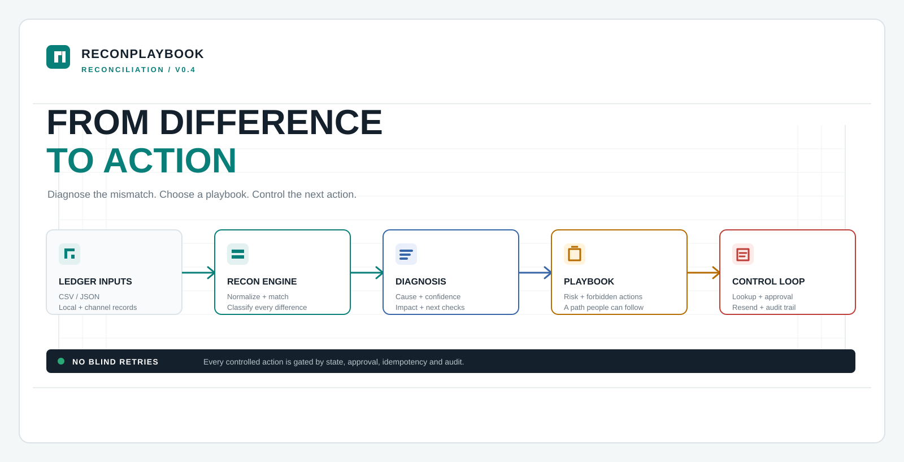
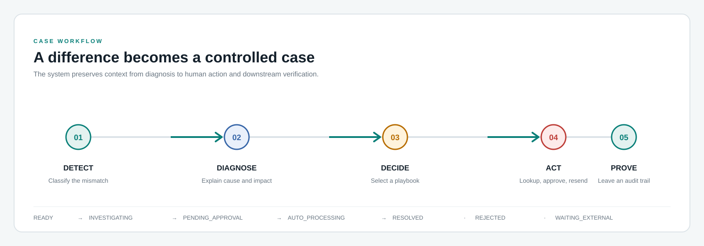
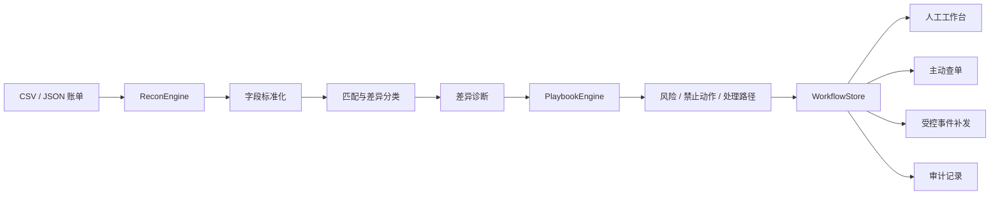

# ReconPlaybook

> 面向支付对账场景的差异诊断与差错处理原型。
>
> 不只告诉你“哪里不一致”，还回答：**为什么不一致、风险有多高、接下来怎么处理、谁处理过、能不能安全补发。**

<p>
  
  
  
  
</p>



## 项目定位

ReconPlaybook 是一个可本地运行的支付对账差错处理原型。

传统对账系统通常停在：

```text
发现差异 → 导出报表 → 人工排查
```

ReconPlaybook 尝试把差异变成一条可追踪的处理链：

```text
账单导入
  ↓
字段标准化与匹配
  ↓
差异分类与诊断
  ↓
差错剧本匹配
  ↓
风险、禁止动作、处理路径
  ↓
状态流转、主动查单、人工介入
  ↓
受控补发与完整审计
```

项目的核心思路是：**差异分类不是终点，而是处理决策的入口。**

<div align="center">
  <sub>把一条差异记录，变成一条有依据、有边界、可审计的处理路径。</sub>
</div>

## V0.4 能做什么

### 1. 统一处理不同账单格式

- 支持 CSV 和 JSON
- 支持 JSON 数组以及 `records`、`data`、`items` 包装结构
- 自动识别常见字段别名
- 将本地流水和渠道账单归一化为统一字段
- 默认按订单号、币种、金额和时间窗口进行匹配

### 2. 识别并诊断差异

当前支持：

| 差异类型 | 典型含义 |
| --- | --- |
| `MATCHED` | 两边记录可以视为同一笔交易 |
| `AMOUNT_MISMATCH` | 订单金额、支付金额或退款口径不一致 |
| `STATUS_MISMATCH` | 本地状态与渠道状态不一致 |
| `FEE_MISMATCH` | 手续费或结算规则不一致 |
| `LATE_ARRIVAL` | 渠道记录超过时间窗口到达 |
| `DUPLICATE_CHANNEL_RECORD` | 相同订单存在额外渠道流水 |
| `UNMATCHED_LOCAL` | 本地有记录，渠道暂未找到对应流水 |
| `UNMATCHED_CHANNEL` | 渠道有记录，本地暂未找到对应流水 |

每条差异还会输出：

- 主要原因
- 判断置信度
- 业务影响
- 证据事实
- 下一步核查项
- 禁止动作

### 3. 用差错剧本驱动处理

差错处理规则配置在 [`playbooks.json`](src/main/resources/playbooks.json) 中。

每个剧本可以定义：

- 适用的差异类型
- 命中条件
- 风险等级
- 自动化程度
- 禁止动作
- 处理路径
- 是否需要人工介入

例如，`STATUS_MISMATCH` 在“本地处理中、渠道成功”的条件下，会命中状态恢复剧本，而不是直接把订单标记为失败或再次扣款。

### 4. 形成可执行的差错工作流

差错单支持以下状态：

```text
READY
  ↓
INVESTIGATING
  ├── WAITING_EXTERNAL
  ├── PENDING_APPROVAL
  ├── RESOLVED
  └── REJECTED

PENDING_APPROVAL
  ↓
AUTO_PROCESSING
  ↓
RESOLVED
```

系统会校验状态流转，不允许绕过审批直接执行受控动作。

### 5. 支持主动查单与受控补发

- 创建主动查单任务
- 查询本地模拟渠道适配器返回的结果
- 查单完成后自动推动差错单进入调查状态
- 对状态不一致案例支持补发支付成功或退款成功事件
- 使用 `caseId:eventType` 作为幂等键
- 重复补发请求不会生成重复业务事件

### 6. 人工工作台与审计

- 人工队列筛选
- 人工介入状态更新
- 处理备注和处理历史
- 差错单状态变更记录
- 查单任务记录
- 补发事件记录
- 幂等拦截记录
- 案例级审计时间线

## 快速开始

### 环境要求

- Java 21
- Maven 3.9+

### 编译与测试

```powershell
mvn clean test
```

### 打包

```powershell
mvn package
```

产物：

```text
target/reconplaybook-v01-0.4.0.jar
```

### 启动

```powershell
java -cp "target/reconplaybook-v01-0.4.0.jar;target/lib/*" com.reconplaybook.ReconApplication
```

打开：

<http://localhost:8080>

如果 8080 已被占用，可以指定其他端口：

```powershell
java -Dport=8081 -cp "target/reconplaybook-v01-0.4.0.jar;target/lib/*" com.reconplaybook.ReconApplication
```

打开：

<http://localhost:8081>

启动后点击 **载入 Demo**，即可查看完整的匹配、诊断、人工队列和差错处理示例。

## 使用流程

1. 导入本地流水和渠道账单，或直接载入 Demo。
2. 点击“开始匹配”。
3. 在结果表中按差异类型、风险等级或人工队列筛选。
4. 点击某条差异打开详情面板。
5. 查看诊断依据、命中剧本、禁止动作和处理路径。
6. 根据工作流推进状态，必要时创建主动查单任务。
7. 对状态不一致案例进入待审批后，可受控补发业务事件。
8. 在详情面板查看任务记录和完整审计时间线。

## 系统结构





### 核心模块

| 模块 | 职责 |
| --- | --- |
| `ReconApplication` | HTTP 服务、静态页面和 API 路由 |
| `ReconEngine` | CSV/JSON 解析、字段标准化、匹配和差异诊断 |
| `PlaybookEngine` | 加载剧本配置并完成条件匹配 |
| `WorkflowStore` | 保存差错单、任务、事件和审计记录 |
| `playbooks.json` | 差错剧本配置 |
| `static/index.html` | 工作台页面结构 |
| `static/app.js` | 结果表、详情面板和工作流交互 |
| `static/styles.css` | 工作台视觉样式 |

## 输入格式

CSV 和 JSON 均支持标准字段或常见别名：

| 标准字段 | 示例别名 |
| --- | --- |
| `orderNo` | `merchant_order_no`, `merchantOrderNo`, `out_trade_no`, `订单号` |
| `tradeNo` | `transaction_id`, `channel_trade_no`, `流水号` |
| `amount` | `total_amount`, `pay_amount`, `金额` |
| `currency` | `currency_code`, `币种` |
| `status` | `trade_status`, `payment_status`, `交易状态` |
| `fee` | `service_fee`, `channel_fee`, `手续费` |
| `time` | `transaction_time`, `paid_at`, `success_time`, `交易时间` |

CSV 示例：

```csv
merchant_order_no,amount,currency,status,fee,transaction_time
ORDER-1001,120.00,CNY,PAYING,0.72,2026-09-12 09:30:00
```

JSON 示例：

```json
[
  {
    "out_trade_no": "ORDER-1001",
    "transaction_id": "CH-1001",
    "total_amount": "120.00",
    "currency_code": "CNY",
    "trade_status": "SUCCESS",
    "service_fee": "0.72",
    "paid_at": "2026-09-12T09:30:09+08:00"
  }
]
```

## API

### 基础接口

| 方法 | 路径 | 说明 |
| --- | --- | --- |
| `GET` | `/api/health` | 服务健康检查和版本信息 |
| `GET` | `/api/demo` | 获取内置 Demo 账单 |
| `GET` | `/api/playbooks` | 查看当前加载的差错剧本 |
| `POST` | `/api/reconcile` | 执行账单匹配和差异诊断 |

### 差错处理接口

| 方法 | 路径 | 说明 |
| --- | --- | --- |
| `GET` | `/api/workbench` | 查看待人工处理队列 |
| `POST` | `/api/case-status` | 执行差错单状态流转 |
| `POST` | `/api/manual-interventions` | 更新人工介入状态 |
| `POST` | `/api/lookup-tasks` | 创建主动查单任务 |
| `GET` | `/api/lookup-tasks?caseId=...` | 查询案例的查单任务 |
| `POST` | `/api/events/resend` | 受控补发业务事件 |
| `GET` | `/api/audit?caseId=...` | 查询案例完整操作记录 |

人工介入请求示例：

```json
{
  "caseId": "结果中的 caseId",
  "operator": "u1001",
  "status": "IN_PROGRESS",
  "note": "已查询渠道最终状态，等待业务确认"
}
```

状态流转请求示例：

```json
{
  "caseId": "结果中的 caseId",
  "status": "PENDING_APPROVAL",
  "actor": "u1001",
  "note": "已完成渠道查单，申请审批"
}
```

事件补发请求示例：

```json
{
  "caseId": "结果中的 caseId",
  "eventType": "PAYMENT_SUCCEEDED",
  "operator": "u1001",
  "note": "审批通过，补发支付成功事件"
}
```

## 测试

当前测试覆盖：

- 字段别名标准化
- 金额差异分类
- 单边记录识别
- 差异诊断和剧本命中
- 差错单初始状态
- 合法和非法状态流转
- 主动查单任务
- 补发事件幂等
- 人工介入闭环
- 审计记录生成

执行：

```powershell
mvn test
```

## 当前边界

这是一个 V0.4 本地原型，当前明确不包含：

- 数据库持久化
- 用户登录和权限控制
- 真实渠道 API
- 真实消息队列
- 真实 Outbox 投递
- 自动修改账务金额
- 自动退款或冲正
- 生产级重试、告警和监控

当前案例、查单任务、补发事件和审计记录都保存在服务进程内存中，服务重启后会清空。

## Roadmap

### V0.5

- 接入数据库持久化
- 增加操作人身份和权限模型
- 增加差错单分页、搜索和批量处理
- 接入真实渠道查单适配器
- 将本地事件模拟替换为 Outbox + 消息队列

### V1.0

- 多渠道插件化接入
- 可视化剧本编辑器
- SLA、超时升级和告警
- 处理效果统计与差异原因分析
- 生产级审计与可观测性

## License

本项目当前作为个人原型项目使用。正式开源前可根据发布计划补充具体 License。
